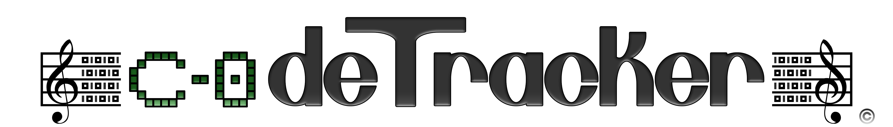

C0deTracker is a sound and music sequencer which allows you to create your instrument and compose your music in your C++ code! The aim of C0deTracker is to replace sound files, in games for example, by hard coded music played in real time. 

You can see the example.hpp file in songs folder to learn how to compose your music.

### Features :

- Notes handling (A4 corresponding to 440 Hz).
- PSG (Pulse Sound Generator) supporting square, sinus, triangle, saw and "pseudo" white noise waveforms, with duty cycle parameter for each, oscillation with basic ADSR (Attack, Decay, Sustain, Release) envelope.
- Basic instrument creation
- Track and frames for composing music with instructions (number of line, index of instrument, volume, note, effects).
- Patterns indexing in a track.
- Channels to generate sound and apply effects separately.
- Supporting all effects in effects.txt file except reverbs effect and instruments swapping.

### What's next? 

- More songs demo!
- Implementing effects for oscillator scope.
- FM and AM synthesis support.
- Wavetable support.
- Simple sample based instrument support.
- More complex sample based instrument supporting frequency and envelope modifications.
- Implements reverb and instrument swapping.

### How to generate sound with C0deTracker?

Well, C0deTracker itself doesn't generate sound, it is note an audio API as we might think. All C0deTracker does is to read the instructions of a track, typed by the user, at time T and generate the corresponding sample of T. Those generated samples could be used with an audio API in order to hear the music. In my case, I used SFML (Simple Fast Multimedia Library) for that.

